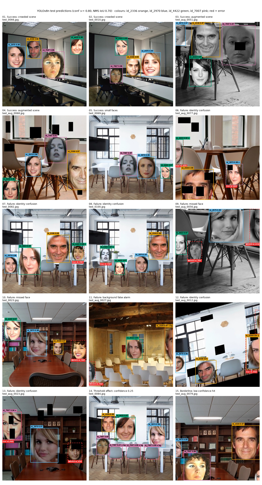
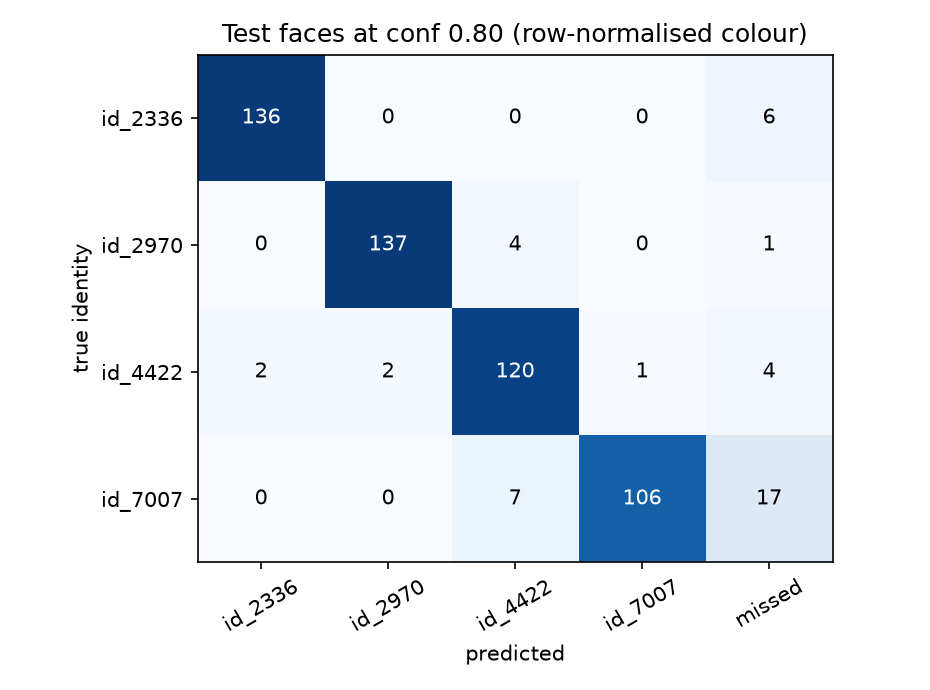

# Detection Visualization Gallery (Milestone 3, Task 4)

Predictions of the fine-tuned YOLOv8n (`results/milestone3/sweep/best_model.pt`, training run `aug_light`) on held-out **test** images, at the operating point selected on the validation split: confidence >= 0.80, NMS IoU 0.70, class-aware NMS, image size 640. Generated by [`milestone3/Detection_Gallery.ipynb`](../../../milestone3/Detection_Gallery.ipynb); examples are selected by fixed rules on the error table, not by hand.

On the whole test split (200 images, 543 faces) the model reaches precision 0.965, recall 0.919 and mean matched IoU 0.971 at this operating point.

**Legend.** Solid box = prediction, in the colour of the predicted identity (id_2336 orange, id_2970 blue, id_4422 green, id_7007 pink), labelled with name and confidence. Red marks errors: `x` = wrong identity, `x dup` = duplicate, `x loc` = box overlaps the face with IoU < 0.5, `x bg` = box on background; a dashed red box is a labelled face that was missed (`MISSED`) or only boxed under another name (`true: <name>`).

| # | Category | Image | Caption |
|---|---|---|---|
| 1 | Success: crowded scene | [`test_0066.jpg`](01_success_crowded_test_0066.jpg) | original scene, 4 labelled faces; 4 found correctly (confidence 0.98). All four identities in one room, each named correctly at 0.98: the typical result on original scenes. |
| 2 | Success: crowded scene | [`test_0010.jpg`](02_success_crowded_test_0010.jpg) | original scene, 4 labelled faces; 4 found correctly (confidence 0.98-0.99). Three faces close together (without overlapping) still get tight, separate boxes. |
| 3 | Success: augmented scene | [`test_aug_0051.jpg`](03_success_augmented_test_aug_0051.jpg) | augmented copy, 4 labelled faces; 4 found correctly (confidence 0.97). Grey-scale copy with a dropout hole on id_7007's face and id_2970 cut by the top-left border: identity is recognized without colour and with partial occlusion. |
| 4 | Success: augmented scene | [`test_aug_0068.jpg`](04_success_augmented_test_aug_0068.jpg) | augmented copy, 4 labelled faces; 4 found correctly (confidence 0.96-0.98). Several dropout holes, and faces at the bottom-left and right borders, are all handled correctly. |
| 5 | Success: small faces | [`test_0069.jpg`](05_success_small_test_0069.jpg) | original scene, 3 labelled faces; 3 found correctly (confidence 0.97-0.98). The smallest face in this selection (id_4422 on the right, about 90 px tall) is still found and named correctly. |
| 6 | Failure: identity confusion | [`test_aug_0077.jpg`](06_fail_identity_test_aug_0077.jpg) | augmented copy, 3 labelled faces; 1 found correctly (id_2336, 0.98); **id_2970 predicted as id_4422** (0.92); **id_4422 predicted as id_2970** (0.89). The Milestone 1 look-alike pair (id_2970 / id_4422) swapped in both directions, with high confidence: the id_2970 face is cut by the left border and the id_4422 face has a dropout hole. Raising the threshold cannot fix confident confusions like these. |
| 7 | Failure: identity confusion | [`test_0082.jpg`](07_fail_identity_test_0082.jpg) | original scene, 4 labelled faces; 3 found correctly (confidence 0.97-0.98); **id_7007 predicted as id_4422** (0.96). id_7007 predicted as id_4422 is the detector's most frequent confusion on test (7 of 16 wrong-identity boxes, see the confusion matrix); here on an unaugmented face, with 0.96 confidence. |
| 8 | Failure: identity confusion | [`test_0100.jpg`](08_fail_identity_test_0100.jpg) | original scene, 4 labelled faces; 3 found correctly (confidence 0.97-0.98); **id_7007 predicted as id_4422** (0.87). The same confusion (id_7007 as id_4422) in the same room, at lower confidence (0.87). |
| 9 | Failure: missed face | [`test_aug_0056.jpg`](09_fail_missed_test_aug_0056.jpg) | augmented copy, 4 labelled faces; 2 found correctly (confidence 0.95-0.97); **id_7007 missed** (134 px tall; the model's best box on it is id_7007 at 0.76, below the threshold); **id_2336 missed** (257 px tall; the model's best box on it is id_7007 at 0.74, below the threshold). Both misses are threshold misses: the model does box these faces, at 0.74-0.76, just under 0.80. One is a small grey-scale face; the other is cut by the right border and boxed under the wrong name. |
| 10 | Failure: missed face | [`test_0023.jpg`](10_fail_missed_test_0023.jpg) | original scene, 4 labelled faces; 3 found correctly (confidence 0.97-0.98); **id_7007 missed** (140 px tall; the model's best box on it is id_4422 at 0.64, below the threshold). A fully visible, unaugmented id_7007 face missed at 0.80; the model's best box on it says id_4422 at 0.64. id_7007 faces are often split between id_7007 and id_4422 at moderate confidence, which is why id_7007 has the lowest test recall (0.815). |
| 11 | Failure: background false alarm | [`test_aug_0027.jpg`](11_fail_background_test_aug_0027.jpg) | augmented copy, 2 labelled faces; 1 found correctly (id_4422, 0.97); **1 box on no labelled face** (id_2336 0.81); **id_7007 missed** (158 px tall; the model's best box on it is id_4422 at 0.76, below the threshold). The 'false alarm' on the right is a correct id_2336 face cut by the crop: the original scene (test_0027) labels id_2336 there, but Milestone 2 dropped the label in this copy because less than 30% of the box remained (min_visibility 0.3). A labelling artefact, not a model error. |
| 12 | Failure: identity confusion | [`test_aug_0012.jpg`](12_fail_identity_test_aug_0012.jpg) | augmented copy, 4 labelled faces; 2 found correctly (confidence 0.91-0.95); **id_4422 predicted as id_2336** (0.81); **id_7007 missed** (181 px tall; the model's best box on it is id_2970 at 0.34, below the threshold). Rotation and the crop push two faces together at the right border: id_7007 is almost entirely cut off, and its loose rotated box overlaps the id_4422 face, which is named id_2336 (0.81). The only overlapping faces in this selection; Milestone 2 composes scenes without overlap, so they only arise from augmentation. |
| 13 | Failure: identity confusion | [`test_aug_0023.jpg`](13_fail_identity_test_aug_0023.jpg) | augmented copy, 3 labelled faces; 1 found correctly (id_2970, 0.97); **id_4422 predicted as id_7007** (0.94); **id_2336 missed** (131 px tall; the model's best box on it is id_7007 at 0.20, below the threshold). Occlusion: dropout holes over the eye and mouth of id_4422 lead to id_7007 (0.94), and a hole over the top of id_2336's head leaves only a 0.20 box. The face is still located, but the identity cues are gone. |
| 14 | Threshold effect: confidence 0.25 | [`test_0084.jpg`](14_threshold_test_0084.jpg) | Drawn at confidence 0.25 instead of 0.80: original scene, 4 labelled faces; 4 found correctly (confidence 0.97-0.99); **3 boxes on no labelled face** (id_7007 0.60, id_7007 0.59, id_7007 0.41). At the operating point, 0 of these remain. Chair backs at head height: the grey backrests in this test room are face-sized and roughly oval, and at the default threshold the model boxes three of them as id_7007 (0.41-0.60). Chair backs were behind every interior test false positive we inspected (46 at 0.25 in total, against 2 on validation); the validation-selected threshold of 0.80 removes them all. |
| 15 | Borderline: low-confidence hit | [`test_aug_0079.jpg`](15_borderline_test_aug_0079.jpg) | augmented copy, 3 labelled faces; 3 found correctly (confidence 0.80-0.97). The lowest-confidence correct detection in the split (id_2970 at 0.80, cut by the left border) sits right at the threshold: a slightly stricter setting would turn it into a miss. |

Identity confusion on the full test split:

Full per-face and per-prediction outcomes: [`test_error_analysis.csv`](test_error_analysis.csv).

## What the gallery shows

Successes cover every identity in crowded original scenes and in augmented copies with
grey-scale, crop borders and dropout holes. The failures fall into four patterns, which match the error counts of the
sweep (Task 3):

1. **Confident identity confusions** (examples 6-8, 12-13): mostly id_7007 → id_4422 and the id_2970 / id_4422
   look-alike pair, at 0.81-0.96. A higher confidence threshold cannot remove these; it would take a better
   identity representation (e.g. the Milestone 1 classifier on the detected crops in Milestone 4) or more varied
   training faces.
2. **Threshold misses** (examples 9-11): faces boxed at 0.6-0.8 and dropped by the 0.80 threshold, mostly id_7007. This
   is the recall paid for the precision gain at the operating point.
3. **Occlusion and crop borders** (examples 9, 11-13): dropout holes over the eyes or mouth, and faces cut by the
   augmentation crop, either break identity or fall below the threshold. Example 11 also shows that a few "false
   positives" are correct detections of cut faces whose labels Milestone 2 removed.
4. **Chair backs at head height** (example 14): the only real background errors. They appear only below the operating
   threshold and only in test rooms with rows of chairs, so the detector partly learned "oval patch at head height".
   Backgrounds with people-like clutter would be a useful addition to the training data.

Localization is not a failure mode: correct boxes have a mean IoU of 0.97 with the labels, and no "loose box" or
duplicate errors remain at the operating point. **Overlapping faces** occur only where augmentation pushes faces
together (example 12), because Milestone 2 placed faces without overlap; real group photos would test this much harder.
